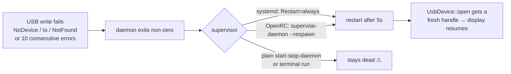

# IMPORTANT NEXT STEPS

Follow-ups from the 0.1.3 fix pass (2026-07-11). Items 1–2 are security-relevant
and affect machines that ran a previous version; the rest are release and
maintenance chores.

## 1. This machine: remove the stale world-writable udev rule

Verified on this host: the old `99-antec-flux-pro-display.rules` (`MODE="0666"`)
is still installed and **overrides** the new `70-` rule (udev applies rule files
in lexical order — `99-` sorts after `70-`, so its `MODE=` assignment wins).
The display's device node is currently `crw-rw-rw-` (0666, world-writable).

```bash
sudo rm -f /etc/udev/rules.d/99-antec-flux-pro-display.rules \
           /lib/udev/rules.d/99-antec-flux-pro-display.rules
getent group plugdev >/dev/null || sudo groupadd -r plugdev
sudo cp packaging/udev/70-antec-flux-pro-display.rules /etc/udev/rules.d/
sudo udevadm control --reload-rules
sudo udevadm trigger --subsystem-match=usb \
    --attr-match=idVendor=2022 --attr-match=idProduct=0522

# Verify: mode should be crw-rw---- (0660), possibly with a '+' (seat ACL)
ls -la $(lsusb -d 2022:0522 | awk '{printf "/dev/bus/usb/%s/%03d", $2, $4}')
```

## 2. Gentoo overlay: update the bundled files

The overlay ebuild (`app-misc/antec-flux-pro-display` in
`/home/costis/github/costis-overlay`) installs its **own copies** from
`FILESDIR`, not this repo's `packaging/` files. They are now out of sync:

- [ ] Replace `files/99-antec-flux-pro-display.rules` (still `MODE="0666"`)
      with this repo's `packaging/udev/70-antec-flux-pro-display.rules`, and
      change the `udev_dorules` line in the ebuild to the new filename.
- [ ] Have the ebuild (or a `pkg_postinst` note) remove/warn about the old
      `99-` rule left behind by previous installs — same shadowing problem as
      item 1.
- [ ] Consider `RDEPEND` on `acct-group/plugdev` (the 0660 rule now makes the
      group meaningful; udev logs "unknown group" and falls back to
      `root:root` without it).
- [ ] Update `files/antec-flux-pro-display.initd`: the daemon now **exits on
      fatal USB errors by design** and relies on its supervisor to restart it.
      OpenRC must run it via `supervise-daemon` with `--respawn`, otherwise an
      unplug/suspend leaves the service dead.



## 3. Release 0.1.3

- [ ] Review and commit the working tree (all changes are uncommitted).
- [ ] Version is already bumped to `0.1.3` in `Cargo.toml` — **do not ship the
      new packaging under 0.1.2**: apt/dpkg would treat it as the same version
      and never upgrade, and the `dpkg-maintscript-helper rm_conffile ... 0.1.3~`
      calls in `preinst`/`postinst`/`postrm` (which delete the obsolete `99-`
      conffile on upgrade) only fire when upgrading to a strictly newer version.
- [ ] Tag and, if publishing a `.deb`, build with `cargo deb` and test an
      upgrade from the 0.1.2 package: after upgrading, `/lib/udev/rules.d/`
      must contain only the `70-` rule.

## 4. Smaller follow-ups

- [ ] **AMD / Intel hardware validation** — the `SysfsGpu` paths (amdgpu,
      i915/xe) are implemented and reviewed but never run on real hardware.
      README now says so; drop the caveat once someone confirms.
- [ ] **Headless NVIDIA boxes** — the hardened unit sets
      `ProtectKernelModules=true`, which stops NVML from auto-loading the
      `nvidia` module. If GPU temp is missing there, load it at boot via
      `/etc/modules-load.d/nvidia.conf` (documented in README Troubleshooting).
- [ ] **Admins with a locally edited unit file** — the unit under `/lib` is no
      longer a dpkg conffile, so upgrades silently overwrite it. Customizations
      belong in a drop-in: `sudo systemctl edit antec-flux-pro-display`.
      Worth a line in release notes.
- [ ] **Optional, future**: udev-based device activation
      (`ENV{SYSTEMD_ALIAS}` + `SYSTEMD_WANTS` + `BindsTo=`) would remove the
      boot-race noise and the 5s restart loop while the display is unplugged.
      Deliberately not done now — it changes how the service starts and needs
      careful testing on this machine first.
- [ ] **README humor** — "If the agentic AI isn't hallucinating" and the
      nVidia jab were replaced with a factual test-status statement. Revert if
      you prefer the original tone.
