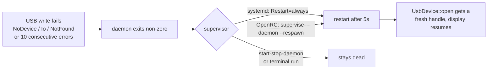

# Open follow-ups

Release notes for 0.1.3 now live in [CHANGELOG.md](CHANGELOG.md). What remains
here is work this repo cannot finish on its own.

## 1. Hosts upgraded from <= 0.1.2 outside dpkg

The old `99-antec-flux-pro-display.rules` (`MODE="0666"`) is not removed by
anything except the Debian maintainer scripts. Where it survives it **shadows**
the new rule — udev applies rule files in lexical order, so `99-` sorts after
`70-` and its `MODE=` assignment wins, leaving the device node world-writable.

The removal commands are in the CHANGELOG's Security section. Verify with:

```bash
ls -la $(lsusb -d 2022:0522 | awk '{printf "/dev/bus/usb/%s/%03d", $2, $4}')
# want crw-rw---- (0660), possibly with a '+' for the seat ACL; 0666 means a
# stale rule is still installed
```

## 2. Gentoo overlay: the bundled files are a separate copy

The `app-misc/antec-flux-pro-display` ebuild installs its **own** files from
`FILESDIR`, not this repo's `packaging/`. Changes here do not reach an
overlay-installed host until the overlay is updated too — and the two have
drifted in *both* directions, so diff before syncing either way.

- [ ] Ship the rule as **`70-`**, not `99-`. Renaming is not cosmetic:
      `TAG+="uaccess"` is only honoured if the tag is set before
      `73-seat-late.rules` runs, so a `99-` file gets the tag ignored and the
      seat ACL is never granted.
- [ ] Keep `GROUP="plugdev"` alongside `uaccess`. Without a group the node is
      `root:root`, which locks out non-seat/daemon use — the case `uaccess`
      does not cover.
- [ ] Have the ebuild remove or warn about a leftover `99-` rule from previous
      installs (same shadowing problem as item 1).
- [ ] `RDEPEND` on `acct-group/plugdev`; udev logs "unknown group" and falls
      back to `root:root` without it.
- [ ] **`antec-flux-pro-display.initd` does not respawn.** It uses
      `command_background=true` + `pidfile`, i.e. `start-stop-daemon`, which
      does not restart the daemon when it exits. Since 0.1.3 the daemon exits
      on fatal USB errors *by design*, so an unplug or suspend leaves the
      service dead. It must run under `supervise-daemon` with `--respawn`.
- [ ] The overlay carries only a `-9999` live ebuild with no `KEYWORDS`, so a
      clean `emerge` fails with "masked by: missing keyword". Either document
      the `**` accept_keywords line in the README or add a versioned ebuild
      once v0.1.3 is tagged.



## 3. Tagging 0.1.3

- [ ] Tag `v0.1.3`. The version bump is load-bearing: the
      `dpkg-maintscript-helper rm_conffile ... 0.1.3~` calls only fire when
      upgrading to a strictly newer version, so the new packaging must not
      ship under 0.1.2.
- [ ] If publishing a `.deb`, build with `cargo deb` and test an upgrade from
      0.1.2: afterwards `/lib/udev/rules.d/` must contain only the `70-` rule.

## 4. Smaller items

- [ ] **AMD / Intel hardware validation** — the `SysfsGpu` paths are
      implemented and reviewed but have never run on real hardware. The README
      and CHANGELOG both say so; drop the caveat once someone confirms.
- [ ] **Headless NVIDIA boxes** — `ProtectKernelModules=true` stops NVML from
      auto-loading the `nvidia` module. If GPU temperature is missing there,
      load it at boot via `/etc/modules-load.d/nvidia.conf` (documented in the
      README's Troubleshooting section).
- [ ] **Self-healing sensors** — CPU and GPU sensors are resolved once at
      startup and never re-probed or re-verified, and every failed read logs at
      the poll rate (~86k lines/day at the default interval). After an hwmon
      rebind the cached path either fails forever or, worse, resolves to a
      different chip's sensor with no error at all. Wanted: log state
      *transitions* rather than occurrences, re-probe with backoff, and verify
      the hwmon `name` on re-probe rather than trusting the index.
- [ ] **Optional: udev-based activation** (`ENV{SYSTEMD_ALIAS}` +
      `SYSTEMD_WANTS` + `BindsTo=`) would remove the boot-race noise and stop
      the 5 s restart loop from running while the display is unplugged.
      Deliberately not done: it changes how the service starts and needs
      careful suspend/resume testing on real hardware first.
